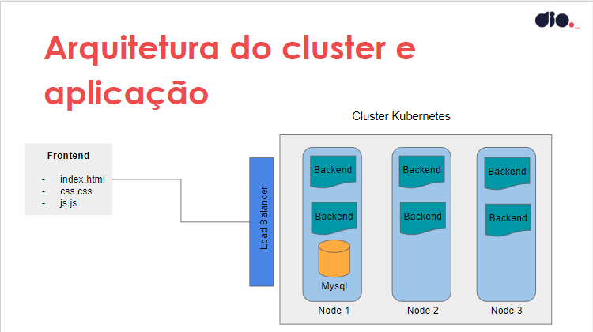

# Kubernetes - Projeto 1

## Deploy de uma aplicação completa

- O projeto tem como objetivo criar um cluster kubernetes para realizar o deploy de uma aplicação completa seguindo a arquitetura na imagem abaixo

## Observações

O projeto teve como base este [repositório](https://github.com/denilsonbonatti/k8s-projeto1-app-base) e as aulas fornecidas pelo professor Denilson Bonatti, dono do repositóio.

No desenvolvimento do projeto serão criadas as imagens dos contêineres e serviços necessários no Kubernetes para que a aplicação esteja pronta para produção.